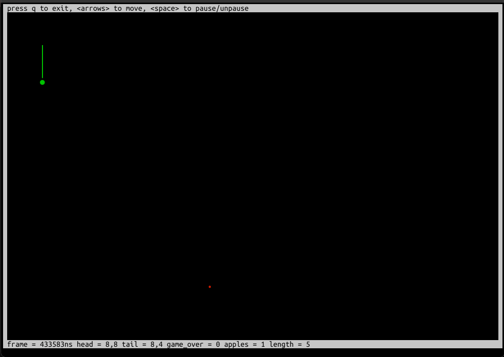

# ansipp

Simple, small, fast and portable library to use colors/drawing directly in terminal.

Not `ncurses` killer, but if you don't need all power of `ncurses` this might be better as its simpler, smaller and faster.
It doesn't store terminal screen in memory.

## Cross platform

It works on 

* Linux (ArchLinux)
* MacOS (Sonoma) 14.5 
* Windows 11

## Hello world

Build & install library: `./install.sh`

Add to your `CMakeLists.txt`:

```cmake
find_package(ansipp REQUIRED)
target_link_libraries(your_executable PRIVATE ansipp::ansipp)
```

Code:

```c++
#include <iostream>
#include <ansipp.hpp>

int main() {
    using namespace ansipp;
    if (std::error_code ec; init(ec, {.hide_cursor=true}), ec) {
        std::cerr << "can't init: " << ec.message() << std::endl;
        return EXIT_FAILURE;
    }

    terminal_stream s;
    s << "hello " << attrs().on(BOLD).fg(RED) << "RED BOLD" << attrs() << " text\n";
    s << std::flush;

    return EXIT_SUCCESS;
}
```

## Features

* No extra dependencies (only `libc` and `stdlib++`)
* CMake support
* Colors (including 8bit and RGB)
* A lot of helpful ANSI escapes 
* Fast terminal I/O routines (direct sys calls, no stdio) with non-blocking reading support
* Terminal stream to buffer all output to send it in one-shot directly to OS
* Automatic restore of terminal modes on `exit`, `SIGINT` (Ctrl+C), `SIGTERM` (excluding Windows)

## Demos

### Snake



### Dead pixels


### Simple gradient and colors


